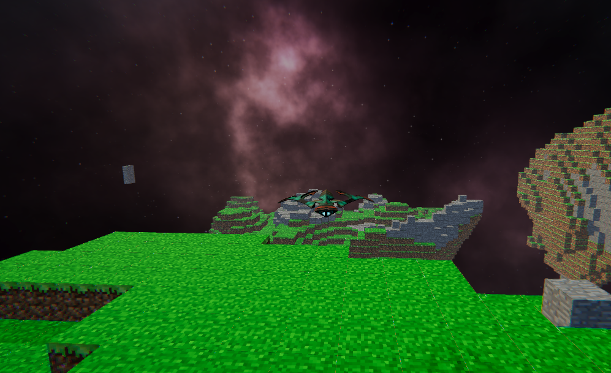

# SpaceCraft

Minecraft like space sandbox. This project was made to try out Compute Shaders in the context of procedural generation.

https://youtu.be/UO0Jot2Hp3Q
https://ondrejvaic.itch.io/space

(This repository is missing the sky box and the 3D model due to licensing)
